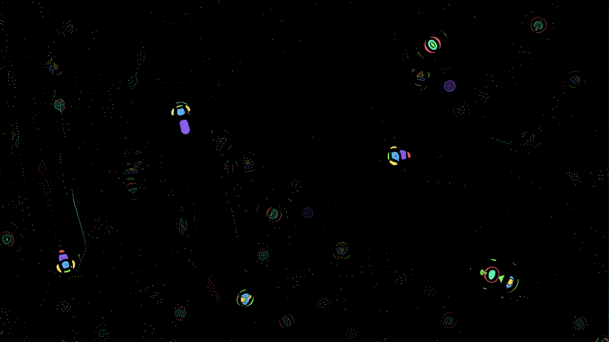

Efficient particle life implementation, writen in JAI with OpenGL, SDL and ImGui.

# Gallery


# Instructions

```sh
$ jai life.jai -o +Autorun
```

# Progress
## Featues
- [x] remove radius and maybe color from instance, maybe bake them into the shader?
- [x] implement 2D Camera, switch to world coordonates
- [x] attraction laws
- [x] gui & tools
- [ ] wasm?

## Performance:
- [x] push update to compute shader
- [ ] async simulation thread 
- [ ] hierarichal structure 

## Quality:
- [x] fix render to texture pipeline, 
      think about how to tie tile resolution to camera zoom
- [x] break the monolith, refactor game loop
- [ ] betteer attraction / reppeleer force profile 
- [ ] refactor tiling logic, 
      i think it should be slightly simpler
- [ ] async logging
- [ ] fix flickering at large zoom out
- [ ] add bloom in post?
